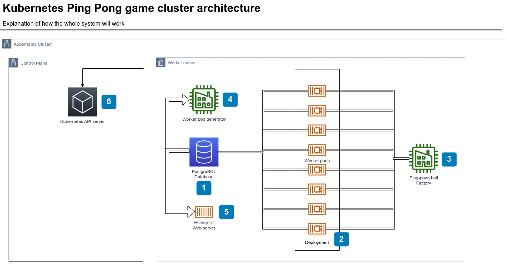

Kubernetes Ping Pong
====================

Welcome to my Kubernetes learning project, Kubernetes Ping Pong!

The goal of this project is for me to experiment with Kubernetes concepts such as

- Containers, pods and deployments
- Services, ingress, networking
- Log management
- Volumes, databases, storage
- Configmaps, secrets, service accounts
- Minikube and managing multiple nodes
- Helm charts
- Kubernetes API server

with a concrete platform to work on! The reason why I call it "Kubernetes Ping Pong" is that I plan to have backend servers throw a request around for a while, a bit as if they were playing ping-pong.

You can see a diagram of the architecture I currently have in mind below. 

1 - The database will record the history of what happened within the worker pods.

2 - The worker pods will be simple APIs whose job will be to receive a request and process it. But the request will come with an identifier for a specific pod, and if the pod receiving the request corresponds to that identifier, it will send a log to the database of the whole request. Otherwise, it will forward that request to another pod at random and add the information on the request that it did go through this specific pod. The request will effectively "ping-pong" around until it lands on the correct pod. A request will be called a (ping-pong) ball in this system.

3 - The Ping-pong ball factory does what its name suggests: it generates ping-pong balls via a cronjob.

4 - The worker pod generator's job is to randomly change the number of pods in the deployment for worker pods, also using a cronjob. Each change is logged in the PostgreSQL database to indicate the birth/death of certain workers, and the ports to which they were assigned.

5 - The History UI server will be used to visualize what happened with the requests. This is where the "Ping-Pong" visual is going to happen!

6 - The Worker pod generator will contact the Kubernetes API server to edit the amount of pods in the deployment by scaling it up and down on a random basis.

Contact me if there's anything you'd like to discuss via LinkedIn!

https://linkedin.com/in/dasilvapatrick